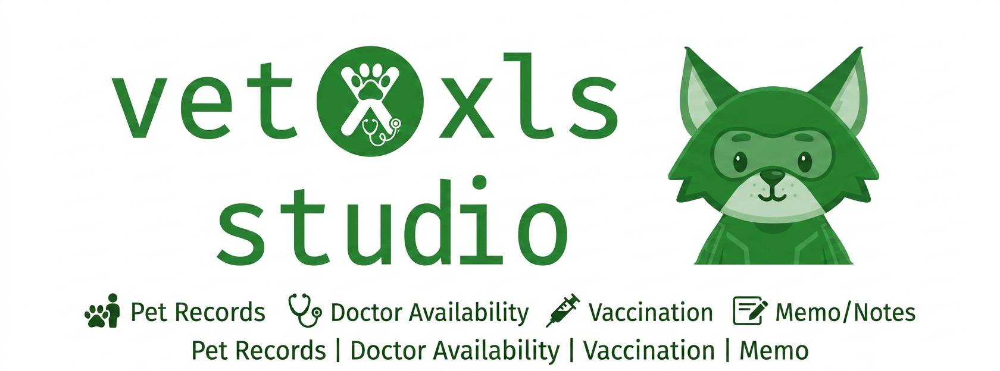
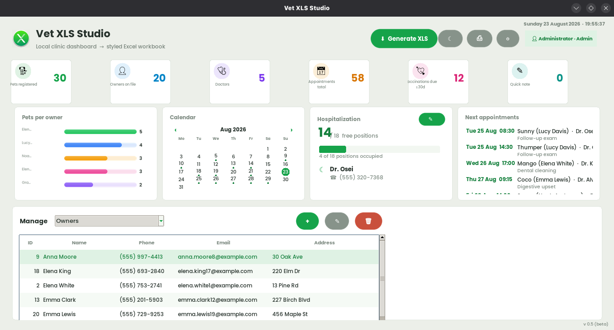

# Vet XLS Studio 🐾

**Vet XLS Studio** is a desktop application for small veterinary clinics.
It keeps track of owners, pets, appointments, treatments and hospital
stays, visualises the clinic activity with colorful charts, and exports
everything to a styled Excel workbook (`.xlsx`).

The interface is available in **English, French and Malagasy**, ships a
modern dark & light theme, and stores its data locally — no cloud, no
account, no telemetry.
Aperçu

<p align="center">  </p>
---

## ✨ Features

| Area | What you get |
|---|---|
| **Dashboard** | Six live stat cards (pets, owners, doctors, appointments, vaccinations due, quick notes) |
| **Calendar** | Month calendar with event dots; click a day to filter the "next appointments" panel |
| **Records** | Full CRUD for owners, pets, appointments and treatments, with searchable tables |
| **Hospitalisation** | Capacity meter with night-guard contact, one-flag pet hospitalisation |
| **Charts** | Pie chart for the species mix, gradient bars/columns per entity, smooth trend area |
| **Quick notes** | Sticky-note list with add / edit / delete, persisted between sessions |
| **Excel export** | One-click styled workbook + print via CUPS (`lp`) on Linux |
| **i18n** | Dates, charts, calendar and every label localised (EN / FR / MG) |
| **Themes** | Dark (charcoal + green accent) and light theme, persisted choice |

## 🔐 First launch

The first start creates an administrator account automatically:

```
username: admin
password: admin123
```

Change the default password before real use (accounts live in
`users.json`, PBKDF2-hashed). Clinic records live in a `data/` folder
(`store.json`, `users.json`, `settings.json`):

- **Windows** — next to `VetXLSStudio.exe` (portable-friendly)
- **Linux** — `~/.local/share/VetXLSStudio/data/`

Back that folder up and you've backed up the clinic.

## 💻 Install & first steps

> 📖 Full step-by-step walkthrough (wizard screens, login,
> data backup, troubleshooting): **[INSTALL.md](INSTALL.md)**

### Windows

1. Grab `VetXLSStudio-Setup-0.5.exe` (see *Building from source* below,
   or ask the maintainer for the file).
2. Run it — a standard guided installer (choose folder, shortcuts,
   uninstaller) powered by Inno Setup, using the app logo as icon.
3. Launch **Vet XLS Studio** from the Start menu or desktop shortcut.

System requirements: Windows 10/11 x64. No other dependencies.

### Linux

User-level install (no root):

```bash
./packaging/linux/install.sh     # binary next to it, or in ../dist/
```

This copies the executable to `~/.local/bin`, installs the logo into the
hicolor icon theme and registers a menu entry (*Office → Vet XLS Studio*).
Uninstall anytime:

```bash
./packaging/linux/uninstall.sh   # keeps your clinic data
```

Or grab the ready-made bundle `VetXLSStudio-0.5-linux-x64.tar.gz`
from `dist/`: unpack, run `install.sh`, done.

Requirements: a graphical session with Tk (present on all mainstream
distros). The Poppins font is optional; without it the UI falls back to
the system font.

## 🛠 Building from source

Requirements: Python 3.11+ , then:

```bash
pip install pillow openpyxl pyinstaller
python main.py                    # run from source
```

**Linux executable**

```bash
pyinstaller packaging/linux/VetXLSStudio.spec
# → dist/VetXLSStudio  (single file)
./packaging/linux/install.sh
```

**Windows — one setup .exe** (built on any Windows machine)

```bat
packaging\windows\build_windows.bat
```

This produces **one file**: `dist\installer\VetXLSStudio-Setup-0.5.exe`
— a normal Windows installer that shows the license agreement, lets you
pick the install folder (default `C:\Program Files\VetXLSStudio`),
creates desktop & Start-menu shortcuts with the app logo, and installs a
clean uninstaller. The whole application is packed as a single
`VetXLSStudio.exe` inside it. Requires the free Inno Setup 6 only for
compiling the installer itself (https://jrsoftware.org/isdl.php).

## 📁 Project structure

```
main.py            entry point (login loop → dashboard)
login.py           login window (language picker, default-admin hint)
ui.py              main dashboard: stats, calendar, charts, CRUD tables
widgets.py         custom themed widgets + MonthCalendar + themes
charts.py          PIL-rendered pie / pills / columns / area charts
models.py          dataclasses + JSON persistence layer
auth.py            PBKDF2-hashed accounts, admin/user roles
workbook.py        styled Excel export (openpyxl)
sample_data.py     demo dataset generator
i18n.py            translations EN/FR/MG + localised date helpers
paths.py           frozen-aware resource/data paths (PyInstaller-safe)
assets/            logo.png, logo.ico, logo-512.png
packaging/
  linux/           spec, .desktop entry, install.sh, png icon
  windows/         spec, Inno Setup script, build batch
data/              created at runtime (JSON storage)
```
## 📸 screenshot

<p align="center">
  
  
</p>
## ⌨️ Handy interactions

- Double-click a table row to edit it
- Click the ✎ Notes stat card for the notes manager
- Scroll the mini calendar to change month; click a day twice to clear
  the appointment filter
- The pencil button on the Hospital card edits capacity & night guard
- Logo click shows the about box 😉

## 📜 License

MIT — see `LICENSE.txt`. Poppins font under SIL OFL 1.1.

Made by Leez · v0.5 (beta)
